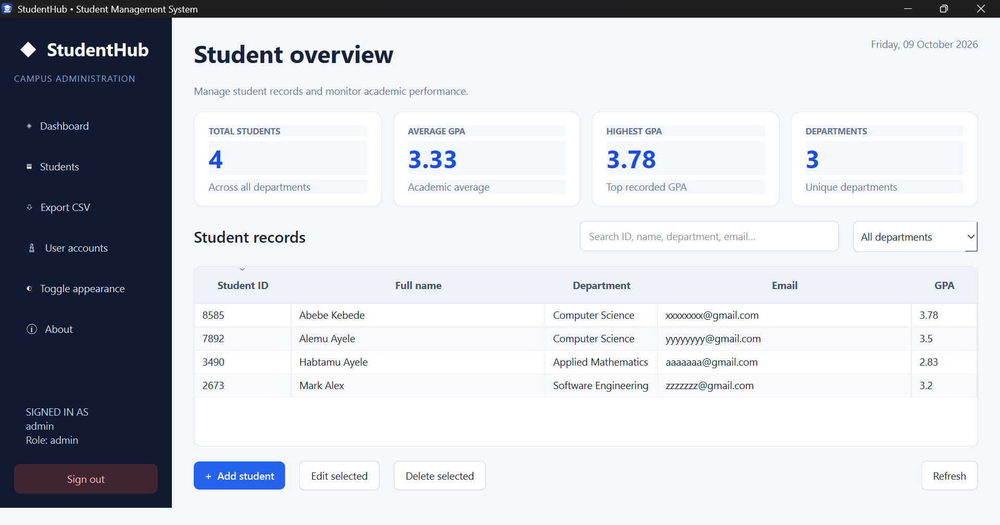
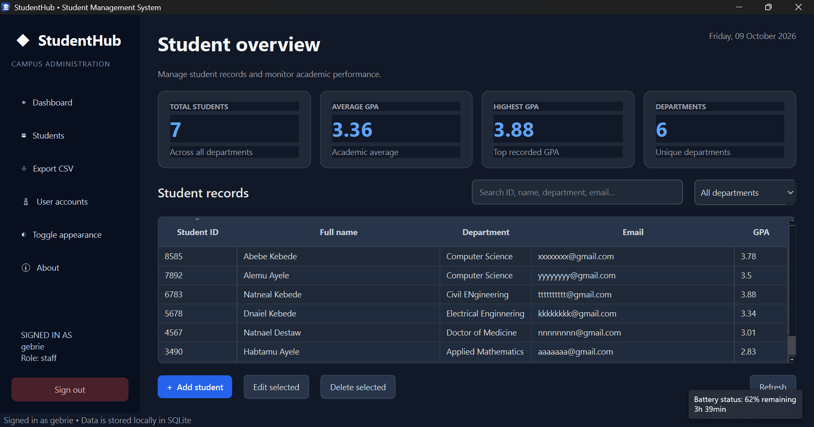
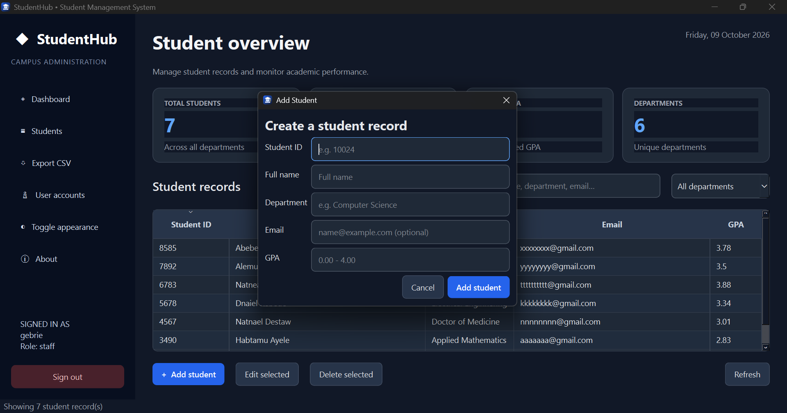

# StudentHub — C++ / Qt 6 Student Management System

A desktop student-record management application built with **C++17, Qt 6 Widgets, and SQLite**. It is designed as a complete coursework project, with a dashboard-style GUI rather than a console menu.

## Screenshots

### Dashboard — Light Mode



### Dashboard — Dark Mode



### Student Records



## Features

- Login dialog with multiple local user accounts and role-based account management
- Passwords stored as salted SHA-256 hashes (classroom-demo level; not production authentication)
- Student CRUD: add, edit, delete, and view records
- Duplicate student ID protection
- Required-field, GPA range, and optional email validation
- Live search across ID, name, department, and email
- Department filter and sortable table columns
- Dashboard statistics: total students, average GPA, highest GPA, and number of departments
- CSV export compatible with Microsoft Excel; exports the current search/filter results
- SQLite persistence
- Light and dark appearance toggle
- Subtle fade-in animation
- Custom SVG application icon
- Confirmation dialog before deleting records

## First-run login

The app creates a default administrator only when the database has no users:

- **Username:** `admin`
- **Password:** `Admin@123`

After signing in, select **User accounts** to create additional `admin` or `staff` accounts. Staff accounts can manage student records but cannot create users.

The database is stored under the platform's application data directory, not the executable directory. On Windows this is typically under `%APPDATA%` in the `StudentHub` application folder. Do not delete the database if you want to keep your records.

## Requirements

- Qt 6 (Qt 6.2 or later recommended)
- Qt Widgets
- Qt SQL module
- Qt's SQLite driver (`QSQLITE`)
- CMake 3.21+
- A C++17 compiler (MSVC with Qt for MSVC, or MinGW with matching Qt MinGW kit)

## Build with Qt Creator (recommended)

1. Install Qt using the official Qt online installer.
2. Select a Qt 6 kit matching your compiler (for example, Qt 6 MinGW 64-bit + MinGW, or Qt 6 MSVC 2022 64-bit + Visual Studio Build Tools).
3. Ensure the **Qt Widgets** and **Qt SQL** modules are installed.
4. Open Qt Creator.
5. Choose **File → Open File or Project**, then select this folder's `CMakeLists.txt`.
6. Select the matching desktop kit and configure the project.
7. Click **Build**, then **Run**.

Do not mix a MinGW Qt kit with an MSVC compiler or vice versa.

## Build with VS Code on Windows

VS Code is the editor; it does not install Qt or a compiler by itself.

1. Install Qt 6 with the **Widgets** and **SQL** modules and a compiler kit.
2. Install CMake and Ninja (or use a CMake generator compatible with your compiler).
3. Install the VS Code extensions **C/C++** and **CMake Tools**.
4. Open the `StudentManagementQt` project folder in VS Code.
5. Configure CMake to use the Qt kit/compiler matching your Qt installation. If CMake cannot locate Qt, set `CMAKE_PREFIX_PATH` to the Qt kit directory (the directory containing `lib/cmake/Qt6`).
6. Configure and build the project.

Example PowerShell commands (replace the Qt path and generator/compiler as appropriate):

```powershell
cmake -S . -B build -DCMAKE_PREFIX_PATH="C:\Qt\6.x.x\mingw_64" -G Ninja
cmake --build build
```

The exact Qt path depends on the installed version and kit. For an MSVC Qt kit, use the corresponding `msvc2022_64` directory and an MSVC developer terminal.

Run the generated executable from the configured build directory. If the executable starts but reports a missing platform plugin or Qt DLL, use Qt's deployment tools (such as `windeployqt`) from the same Qt kit to deploy dependencies.

## Data and CSV notes

- SQLite file: `students.db` in the app's writable application-data directory.
- CSV exports contain the currently visible search/filter result set.
- Fields containing commas, quotes, or line breaks are quoted/escaped for CSV.
- For best Excel compatibility with non-ASCII names, open/import the CSV as UTF-8.

## Important security note

This is an educational desktop project. Passwords are salted and hashed, but SHA-256 is not a password-hardening algorithm. A production system should use Argon2id, scrypt, or bcrypt, apply account lockout/rate limits, and use a more rigorous authorization model. The initial demo credentials should be changed in a production deployment.

## Project structure

```text
StudentManagementQt/
├── CMakeLists.txt
├── main.cpp
├── README.md
└── assets/
    ├── app_icon.svg
    └── resources.qrc
```

## Troubleshooting

- **`Qt6Config.cmake` not found:** point `CMAKE_PREFIX_PATH` at the installed Qt kit directory.
- **No QSQLITE driver:** install/use a Qt distribution that includes the Qt SQLite driver plugin. In Qt's installer, check the Qt SQL component.
- **Compiler mismatch:** choose a Qt kit and compiler from the same toolchain.
- **Database error:** make sure the application-data directory is writable.
